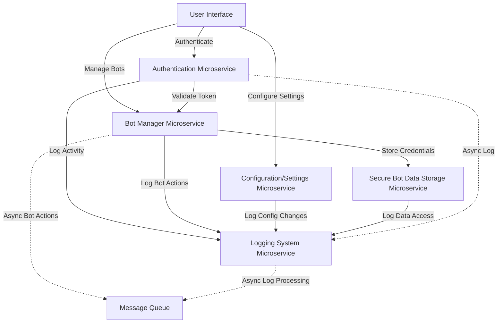

# Architecture Design for ViveSphere Bot Manager - Phase 1

**Objective**: Document the microservices architecture for Phase 1 of the ViveSphere Bot Manager system, identifying boundaries, responsibilities, and communication protocols for each service to ensure modularity and scalability.

## Overview

The ViveSphere Bot Manager system adopts a microservices architecture to ensure modularity, scalability, and maintainability. In Phase 1, the focus is on establishing the foundational backend components. This document outlines the core microservices identified for Phase 1, their responsibilities, and how they interact with each other.

## Core Microservices

The following microservices are defined for Phase 1, each adhering to the Single Responsibility Principle:

1. **Authentication Microservice**
   - **Responsibility**: Handles user authentication, session management, and token issuance/validation using JWT (JSON Web Tokens).
   - **Communication Type**: REST for synchronous communication with other services requiring authentication checks.
   - **Directory**: `backend/authentication/`

2. **Bot Manager Microservice**
   - **Responsibility**: Manages the creation, operation, and integration of bots with the X platform API for posting and retrieving statistics.
   - **Communication Type**: REST for synchronous operations; planned asynchronous communication via message queues for bot actions.
   - **Directory**: `backend/bot_manager/`

3. **Configuration/Settings Microservice**
   - **Responsibility**: Provides centralized configuration management for application settings and user roles, avoiding hardcoded values in the codebase.
   - **Communication Type**: REST for synchronous retrieval and updates of configuration data.
   - **Directory**: `backend/configuration/`

4. **Logging System Microservice**
   - **Responsibility**: Captures, categorizes, and stores logs for user activity, debug information, terminal, and console outputs across the system.
   - **Communication Type**: Primarily asynchronous via message queues to collect logs from other services; REST for log retrieval.
   - **Directory**: `backend/logging/`

5. **Secure Bot Data Storage Microservice**
   - **Responsibility**: Securely stores sensitive bot data (e.g., credentials, API tokens) with encryption at rest and strict access controls based on RBAC.
   - **Communication Type**: REST for synchronous data storage and retrieval with strong security measures.
   - **Directory**: `backend/secure_bot_data/`

## Interaction Flowchart

Below is a simplified Mermaid flowchart illustrating the interactions between the core microservices in Phase 1. This diagram focuses on the primary data flows and communication protocols.

## Communication Protocols

- **REST APIs**: Used for synchronous communication between microservices where immediate responses are required, such as authentication token validation or configuration retrieval. All REST endpoints are versioned (e.g., `/api/v1/`) for backward compatibility.
- **Asynchronous Communication**: Planned via message queues (e.g., RabbitMQ or Kafka) for non-immediate tasks like logging or scheduling bot actions. This decouples services and improves system resilience by allowing components to process tasks independently.

## Data Flow

- **Authentication Flow**: Users authenticate through the Authentication Microservice, which issues JWT tokens. These tokens are validated by other microservices (e.g., Bot Manager) before allowing access to protected operations.
- **Bot Management Flow**: Bot creation and management requests are handled by the Bot Manager Microservice, which securely stores credentials via the Secure Bot Data Storage Microservice and logs actions through the Logging System Microservice.
- **Configuration Flow**: Application settings and roles are managed by the Configuration/Settings Microservice, accessible to other services for dynamic configuration updates.
- **Logging Flow**: All microservices send logs (user activity, debug, etc.) to the Logging System Microservice, primarily asynchronously via message queues to minimize performance impact.
- **Secure Data Storage Flow**: Sensitive bot data is encrypted and stored by the Secure Bot Data Storage Microservice, accessible only to authorized services/users with appropriate permissions.

## Future Considerations

- **Scalability**: Each microservice is designed to scale horizontally by adding more instances managed by Kubernetes, as load increases.
- **Modularity**: The architecture follows Domain-Driven Design (DDD) principles to ensure components can be replaced or upgraded independently.
- **Additional Microservices**: Future phases will introduce additional microservices (e.g., Content Engine, Trends Research) that will integrate with the existing architecture via the API Gateway and message queues.

This document serves as the foundation for the architectural design in Phase 1, ensuring a clear understanding of service boundaries and interactions as implementation progresses.