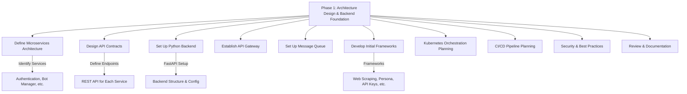

# Implementation Plan for Phase 1: Architecture Design and Backend Foundation

**Objective**: Establish the foundational architecture and backend components for the ViveSphere Bot Manager system, focusing on a microservices-based design, core service setup, and initial frameworks for key functionalities as outlined in the PRD.

## Step 1: Define Microservices Architecture
- **Goal**: Identify and document the boundaries and responsibilities of each microservice to ensure modularity and scalability.
- **Detailed Actions**:
  1. **Identify Core Microservices**: Based on the PRD, define the following initial microservices for Phase 1:
     - **Authentication Microservice**: Handles user login, session management, and token issuance (JWT).
     - **Bot Manager Microservice**: Manages bot creation, operations, and integration with X platform API.
     - **Configuration/Settings Microservice**: Manages application settings and roles, avoiding hardcoded values.
     - **Logging System Microservice**: Captures and stores logs for user activity and debugging.
     - **Secure Bot Data Storage Microservice**: Securely stores bot credentials and sensitive data.
  2. **Define Responsibilities**: Document the Single Responsibility Principle for each microservice:
     - Authentication: User authentication, session management, token validation.
     - Bot Manager: Bot creation, management, X API interactions.
     - Configuration/Settings: Centralized configuration management, role assignments.
     - Logging: Log collection, categorization, storage.
     - Secure Bot Data: Encrypted storage and access control for bot data.
  3. **Design Communication**: Specify communication protocols:
     - Use REST APIs for synchronous communication between services (e.g., Authentication to Bot Manager for access validation).
     - Plan for asynchronous communication using message queues (RabbitMQ or Kafka) for tasks like logging or bot actions.
  4. **Document Architecture**: Create a detailed architecture document in `docs/architecture_design.md` with:
     - List of microservices and their responsibilities.
     - Interaction flowchart (update the Mermaid diagram from PRD to reflect Phase 1 focus).
     - Communication protocols and data flow.
- **Tools and Configurations**:
  - Use Markdown for documentation.
  - Reference PRD sections 3.1 (Microservices-Based Architecture) and 3.5 (Scalability and Future-Proofing) for guidelines on modularity and Kubernetes orchestration.
- **Variables**:
  - `microservices_list`: Array of objects with keys `name`, `responsibility`, `communication_type` (REST or async).
  - `architecture_doc_path`: String, set to `docs/architecture_design.md`.

## Step 2: Design API Contracts for Microservices
- **Goal**: Establish well-defined API contracts for inter-service communication to ensure consistency and reliability.
- **Detailed Actions**:
  1. **Define Endpoints**: For each microservice, specify REST API endpoints:
     - **Authentication Microservice**:
       - `POST /api/v1/auth/login`: Parameters: `username`, `password`; Returns: JWT token.
       - `GET /api/v1/auth/validate`: Parameters: `token`; Returns: Validation status.
     - **Bot Manager Microservice**:
       - `POST /api/v1/bots/create`: Parameters: `bot_name`, `credentials`; Returns: Bot ID.
       - `GET /api/v1/bots/list`: Parameters: `user_id`; Returns: List of bots.
     - **Configuration/Settings Microservice**:
       - `GET /api/v1/config/settings`: Parameters: `service_name`; Returns: Configuration data.
       - `POST /api/v1/config/update`: Parameters: `settings_data`; Returns: Update status.
     - **Logging System Microservice**:
       - `POST /api/v1/logs/submit`: Parameters: `log_type`, `log_data`; Returns: Submission status.
     - **Secure Bot Data Storage Microservice**:
       - `POST /api/v1/botdata/store`: Parameters: `bot_id`, `data`; Returns: Storage status.
       - `GET /api/v1/botdata/retrieve`: Parameters: `bot_id`; Returns: Encrypted data.
  2. **Specify Data Formats**: Use JSON for request/response payloads, adhering to OpenAPI/Swagger standards for documentation.
  3. **Versioning**: Implement API versioning (e.g., `/api/v1/`) for backward compatibility as per PRD section 3.5.
  4. **Security**: Define authentication requirements (JWT tokens) for each endpoint to ensure secure access.
  5. **Document Contracts**: Create an API specification document in `docs/api_contracts.md` or use a tool like Swagger UI for interactive documentation.
- **Tools and Configurations**:
  - Use OpenAPI/Swagger for API documentation.
  - Reference PRD section 3.1 for API Gateway and communication standards.
- **Variables**:
  - `api_endpoints`: Object mapping microservice names to arrays of endpoint definitions (method, path, parameters, response).
  - `api_doc_path`: String, set to `docs/api_contracts.md`.

## Step 3: Set Up Python Backend for Core Microservices
- **Goal**: Develop the initial backend structure for core microservices using Python, focusing on FastAPI for performance.
- **Detailed Actions**:
  1. **Project Structure**: Create a directory structure for microservices under `backend/`:
     - `backend/authentication/`
     - `backend/bot_manager/`
     - `backend/configuration/`
     - `backend/logging/`
     - `backend/secure_bot_data/`
  2. **Initialize FastAPI Apps**: For each microservice, create a `main.py` file with a basic FastAPI setup:
     - Example for `backend/authentication/main.py`:
       ```python
       from fastapi import FastAPI
       app = FastAPI(title="Authentication Microservice", version="1.0.0")
       @app.post("/api/v1/auth/login")
       async def login(username: str, password: str):
           # Placeholder for authentication logic
           return {"token": "placeholder_jwt"}
       ```
  3. **Install Dependencies**: Define a `requirements.txt` for each microservice with necessary libraries:
     - `fastapi`, `uvicorn` (for running the server), `PyJWT` (for token management), `SQLAlchemy` (for database access), `loguru` (for logging).
  4. **Database Setup**: Use SQLite for development as per PRD section 3.4:
     - Create a `db/` directory for each microservice to store SQLite databases (e.g., `backend/authentication/db/auth.db`).
     - Initialize SQLAlchemy models for basic tables (e.g., Users for Authentication, Bots for Bot Manager).
  5. **Configuration Management**: Implement configuration loading to avoid hardcoded values (PRD section 3.7):
     - Create a `config/` directory with YAML files (e.g., `config/auth.yaml` for Authentication settings).
     - Use `PyYAML` to load configurations and `python-dotenv` for environment variables.
     - Example `config/auth.yaml`:
       ```yaml
       database:
         path: "db/auth.db"
       jwt:
         secret: "placeholder_secret"
         expiry: 3600
       ```
  6. **Basic Error Handling**: Add error handling middleware in FastAPI for robustness (PRD section 3.6).
- **Tools and Configurations**:
  - Python 3.9+ for development.
  - FastAPI framework for API development.
  - SQLite for initial database setup.
  - Reference PRD sections 3.2 (Backend Python) and 3.7 (Centralized Configuration Management).
- **Variables**:
  - `backend_base_path`: String, set to `backend/`.
  - `requirements_list`: Array of strings for dependencies per microservice.
  - `config_files`: Object mapping microservice names to their config file paths.

## Step 4: Establish API Gateway Infrastructure
- **Goal**: Set up an API Gateway to handle routing, authentication, and rate limiting for microservices.
- **Detailed Actions**:
  1. **Select Gateway**: Choose Kong or Traefik as the API Gateway based on PRD section 3.1.
  2. **Configuration**: Create a configuration file for the gateway in `infrastructure/api_gateway/`:
     - Define routing rules to map external requests to internal microservice endpoints (e.g., `/api/v1/auth/*` to Authentication service).
     - Set up authentication plugins to validate JWT tokens before forwarding requests.
     - Configure rate limiting to prevent abuse (e.g., 100 requests/minute per client).
  3. **Docker Setup**: Create a `Dockerfile` and `docker-compose.yml` for the API Gateway to ensure consistency across environments:
     - Example `docker-compose.yml` snippet:
       ```yaml
       services:
         api-gateway:
           image: kong:latest
           ports:
             - "8000:8000"
           environment:
             - KONG_DATABASE=off
       ```
  4. **Documentation**: Document setup and configuration steps in `docs/api_gateway_setup.md`.
- **Tools and Configurations**:
  - Kong or Traefik for API Gateway.
  - Docker for containerization.
  - Reference PRD section 3.1 for API Gateway requirements.
- **Variables**:
  - `gateway_choice`: String, set to `Kong` or `Traefik`.
  - `gateway_config_path`: String, set to `infrastructure/api_gateway/config.yaml`.

## Step 5: Set Up Message Queue Infrastructure
- **Goal**: Implement message queue infrastructure for asynchronous communication between microservices.
- **Detailed Actions**:
  1. **Select Queue**: Choose RabbitMQ or Kafka based on PRD section 3.1 for asynchronous tasks like logging or bot actions.
  2. **Configuration**: Set up configuration in `infrastructure/message_queue/`:
     - Define queues for specific tasks (e.g., `log_queue` for logging, `bot_action_queue` for bot operations).
     - Set up connection parameters (host, port, credentials) using environment variables for security.
  3. **Docker Setup**: Create Docker configurations for the message queue:
     - Example `docker-compose.yml` snippet for RabbitMQ:
       ```yaml
       services:
         rabbitmq:
           image: rabbitmq:3-management
           ports:
             - "5672:5672"
             - "15672:15672"
       ```
  4. **Integration**: Plan integration points in microservices (e.g., Logging Microservice publishes to `log_queue`, Bot Manager consumes from `bot_action_queue`).
  5. **Documentation**: Document setup in `docs/message_queue_setup.md`.
- **Tools and Configurations**:
  - RabbitMQ or Kafka for message queuing.
  - Docker for containerization.
  - Reference PRD section 3.1 for asynchronous communication.
- **Variables**:
  - `queue_choice`: String, set to `RabbitMQ` or `Kafka`.
  - `queue_config_path`: String, set to `infrastructure/message_queue/config.yaml`.

## Step 6: Develop Initial Frameworks for Key Functionalities
- **Goal**: Create initial code frameworks for essential functionalities as outlined in Phase 1 of the PRD.
- **Detailed Actions**:
  1. **Web Scraping Framework** (for Trends Research):
     - Directory: `backend/trends_research/`.
     - Use `requests` and `beautifulsoup4` for basic scraping logic.
     - Create placeholder functions for scraping X platform trends (e.g., `scrape_trends()`).
  2. **Persona Management Framework**:
     - Directory: `backend/persona_setup/`.
     - Define database models for persona attributes (tone, interests) using SQLAlchemy.
     - Create API endpoints like `POST /api/v1/personas/create`.
  3. **API Key Management Framework**:
     - Directory: `backend/api_key_management/`.
     - Set up secure storage for API keys with encryption using `cryptography` library.
     - Create endpoints like `POST /api/v1/apikeys/store`.
  4. **Metrics Collection Framework**:
     - Directory: `backend/metrics_dashboard/`.
     - Define data structures for storing bot performance metrics.
     - Plan integration with Prometheus for monitoring (placeholder setup).
  5. **User Authentication Framework**:
     - Enhance `backend/authentication/` with user models, password hashing, and JWT token generation.
  6. **Role Management Framework**:
     - Within `backend/configuration/`, define role and permission models.
     - Create endpoints for role assignment (e.g., `POST /api/v1/roles/assign`).
  7. **Logging Framework**:
     - In `backend/logging/`, use `loguru` to set up logging with multiple handlers (file, database).
     - Define log categories (user activity, debug).
  8. **Secure Bot Data Storage Framework**:
     - In `backend/secure_bot_data/`, implement encryption for sensitive data using `cryptography`.
     - Define access control logic based on RBAC.
- **Tools and Configurations**:
  - Python libraries: `requests`, `beautifulsoup4`, `cryptography`, `loguru`, `SQLAlchemy`.
  - FastAPI for API endpoints.
  - Reference PRD sections 4.1 to 4.15 for module-specific requirements.
- **Variables**:
  - `framework_paths`: Object mapping functionality to directory paths.
  - `dependencies`: Array of required Python libraries per framework.

## Step 7: Kubernetes Orchestration Planning
- **Goal**: Plan Kubernetes setup for managing microservices, ensuring scalability and fault tolerance.
- **Detailed Actions**:
  1. **Define Kubernetes Resources**: Create placeholder YAML files in `infrastructure/kubernetes/` for:
     - Deployments for each microservice (e.g., `auth-deployment.yaml`).
     - Services for internal communication (e.g., `auth-service.yaml`).
     - ConfigMaps for configuration data.
  2. **Scaling Policies**: Define auto-scaling rules based on CPU/memory usage as per PRD section 3.5.
  3. **Documentation**: Document Kubernetes setup steps in `docs/kubernetes_setup.md`.
- **Tools and Configurations**:
  - Kubernetes for orchestration.
  - Docker for containerization.
  - Reference PRD section 3.1 for orchestration details.
- **Variables**:
  - `k8s_config_path`: String, set to `infrastructure/kubernetes/`.

## Step 8: CI/CD Pipeline Setup Planning
- **Goal**: Plan a CI/CD pipeline for automated testing and deployment.
- **Detailed Actions**:
  1. **Choose Tool**: Select GitHub Actions or Jenkins as per PRD section 3.5.
  2. **Define Workflow**: Create a workflow file in `infrastructure/ci_cd/` for:
     - Running unit tests with `pytest`.
     - Building Docker images.
     - Deploying to Kubernetes.
  3. **Documentation**: Document CI/CD setup in `docs/ci_cd_setup.md`.
- **Tools and Configurations**:
  - GitHub Actions or Jenkins for CI/CD.
  - Reference PRD section 3.5 for CI/CD requirements.
- **Variables**:
  - `ci_cd_tool`: String, set to `GitHub Actions` or `Jenkins`.
  - `ci_cd_config_path`: String, set to `infrastructure/ci_cd/`.

## Step 9: Security and Best Practices Integration
- **Goal**: Ensure security and adherence to best practices in the foundational setup.
- **Detailed Actions**:
  1. **Security Measures**:
     - Implement input validation in FastAPI endpoints.
     - Use environment variables for sensitive data (PRD section 3.7).
     - Plan OAuth 2.0 integration for API security (PRD section 3.6).
  2. **Code Quality**:
     - Set up linting with `flake8` and static analysis with `bandit` to avoid hardcoded values.
     - Plan unit testing with `pytest` for each microservice.
  3. **Documentation**: Document security policies and coding standards in `docs/security_best_practices.md`.
- **Tools and Configurations**:
  - Python tools: `flake8`, `bandit`, `pytest`.
  - Reference PRD section 3.6 for best practices and security.
- **Variables**:
  - `security_tools`: Array of tools for linting and testing.

## Step 10: Review and Documentation
- **Goal**: Compile all Phase 1 deliverables into comprehensive documentation for review.
- **Detailed Actions**:
  1. **Compile Documents**: Gather all created documentation (`architecture_design.md`, `api_contracts.md`, etc.) into a `docs/phase1/` directory.
  2. **Summary Report**: Create a summary report `docs/phase1/summary.md` outlining:
     - Completed steps.
     - Key configurations and variables.
     - Next steps for Phase 2.
  3. **Version Control**: Ensure all code and documentation are version-controlled in Git.
- **Tools and Configurations**:
  - Markdown for documentation.
  - Git for version control.
- **Variables**:
  - `phase1_docs_path`: String, set to `docs/phase1/`.

## Mermaid Diagram for Phase 1 Workflow
Below is a simplified Mermaid flowchart focusing on the Phase 1 architecture and setup process. This can be rendered as an image using a Mermaid-compatible tool and saved as `docs/phase1/architecture_phase1.png`.



## Verification Checklist and Testing Strategy for Phase 1
- **Goal**: Ensure all components of Phase 1 are completed, functional, and meet the specified requirements through a structured verification and testing process.
- **Verification Checklist**:
  - [x] **Microservices Architecture Definition**:
    - Confirm that all core microservices (Authentication, Bot Manager, Configuration/Settings, Logging, Secure Bot Data Storage) are identified and documented in `docs/architecture_design.md`.
    - Verify that responsibilities and communication protocols (REST and async) are clearly defined for each microservice.
  - [x] **API Contracts Design**:
    - Ensure all specified endpoints for each microservice are documented in `docs/api_contracts.md`.
    - Check that data formats (JSON), versioning, and security requirements (JWT) are included in the API contracts.
  - [x] **Python Backend Setup**:
    - Validate that directory structures for all microservices are created under `backend/`.
    - Confirm that FastAPI apps are initialized with basic endpoints in `main.py` for each microservice.
    - Verify that `requirements.txt` files include necessary dependencies (`fastapi`, `uvicorn`, `PyJWT`, `SQLAlchemy`, `loguru`).
    - Check that SQLite database setups are planned with SQLAlchemy models in place.
    - Ensure configuration management avoids hardcoded values using YAML files and environment variables.
  - [x] **API Gateway Infrastructure**:
    - Confirm selection of API Gateway (Kong or Traefik) and documentation of configuration in `infrastructure/api_gateway/`.
    - Verify Docker setup files (`Dockerfile`, `docker-compose.yml`) are prepared for the API Gateway.
  - [x] **Message Queue Infrastructure**:
    - Ensure selection of message queue (RabbitMQ or Kafka) and configuration setup in `infrastructure/message_queue/`.
    - Validate Docker configuration for the message queue and integration points with microservices.
  - [x] **Initial Frameworks for Key Functionalities**:
    - Check that frameworks for Web Scraping, Persona Management, API Key Management, Metrics Collection, User Authentication, Role Management, Logging, and Secure Bot Data Storage are set up in their respective directories with placeholder functions or basic implementations.
  - [x] **Kubernetes Orchestration Planning**:
    - Verify placeholder YAML files for deployments, services, and ConfigMaps are created in `infrastructure/kubernetes/`.
    - Confirm auto-scaling policies are defined.
  - [x] **CI/CD Pipeline Setup Planning**:
    - Ensure selection of CI/CD tool (GitHub Actions or Jenkins) and workflow definition in `infrastructure/ci_cd/`.
  - [x] **Security and Best Practices Integration**:
    - Validate plans for input validation, environment variables for sensitive data, and OAuth 2.0 integration.
    - Confirm setup for linting (`flake8`), static analysis (`bandit`), and unit testing (`pytest`).
  - [x] **Review and Documentation**:
    - Ensure all documentation is compiled in `docs/phase1/` directory.
    - Verify summary report `docs/phase1/summary.md` outlines completed steps and next steps for Phase 2.
- **Testing Strategy**:
  - **Unit Testing**: Develop unit tests for each microservice using `pytest` to validate individual functions and endpoints. For example, test the `/api/v1/auth/login` endpoint in the Authentication Microservice to ensure it returns a token with valid credentials.
    - **Tool**: `pytest`
    - **Location**: Create test files in `backend/[microservice]/tests/` (e.g., `backend/authentication/tests/test_auth.py`).
    - **Coverage**: Aim for at least 80% code coverage for critical components.
  - **Integration Testing**: Test interactions between microservices through their API endpoints to ensure proper communication (e.g., Authentication token validation by Bot Manager).
    - **Tool**: Use `pytest` with mock servers or temporary Docker containers to simulate microservice interactions.
    - **Scenario**: Simulate a user login followed by a bot creation request to verify token validation and data flow.
  - **API Contract Testing**: Use tools like Postman or automated scripts to test API endpoints against the defined contracts in `docs/api_contracts.md`.
    - **Tool**: Postman or `requests` library in Python for automated testing.
    - **Validation**: Ensure responses match expected formats (JSON), status codes, and security requirements (JWT presence).
  - **Configuration Testing**: Verify that configurations load correctly from YAML files and environment variables override defaults as expected.
    - **Method**: Write test scripts to load configurations and assert values match expected settings.
  - **Docker and Kubernetes Setup Testing**: Test Docker images and Kubernetes configurations to ensure they build and deploy without errors.
    - **Tool**: Use `docker-compose` for local testing of API Gateway and message queue setups.
    - **Validation**: Confirm containers start without errors and basic health checks pass (e.g., API Gateway responds on port 8000).
  - **Security Testing**: Perform basic security checks to ensure no hardcoded sensitive data exists in the codebase and input validation is in place.
    - **Tool**: Use `bandit` for static analysis to detect security issues.
    - **Focus**: Check for hardcoded secrets and ensure environment variables are used for sensitive configurations.
  - **Documentation Testing**: Manually review documentation for completeness and accuracy against the implemented setup.
    - **Method**: Cross-verify each documented step with the actual files and configurations in the repository.
  - **Test Execution and Reporting**: Integrate tests into the CI/CD pipeline (planned in Step 8) to run automatically on code changes, with results reported in a test summary document (`docs/phase1/test_summary.md`).
    - **Frequency**: Run tests on every commit or pull request to catch issues early.
    - **Reporting**: Summarize test results, including passed/failed tests and coverage metrics, in the documentation.

## Final Notes for AI Agent
- **Execution Order**: Follow the steps sequentially, ensuring each step is completed and documented before moving to the next.
- **File Paths**: All paths are relative to `d:/Programacion/vive_sphere`. Use `write_to_file` tool for creating documentation and code files.
- **Dependencies**: Install required Python libraries using `requirements.txt` for each microservice.
- **Security**: Prioritize security in configurations and data handling, using environment variables for sensitive information.
- **Feedback Loop**: After completing documentation for each step, use `attempt_completion` to present results and await user feedback before proceeding to implementation if needed.
- **Verification and Testing**: Use the Verification Checklist to ensure all components are in place, and follow the Testing Strategy to validate functionality, integration, and security of the Phase 1 deliverables.